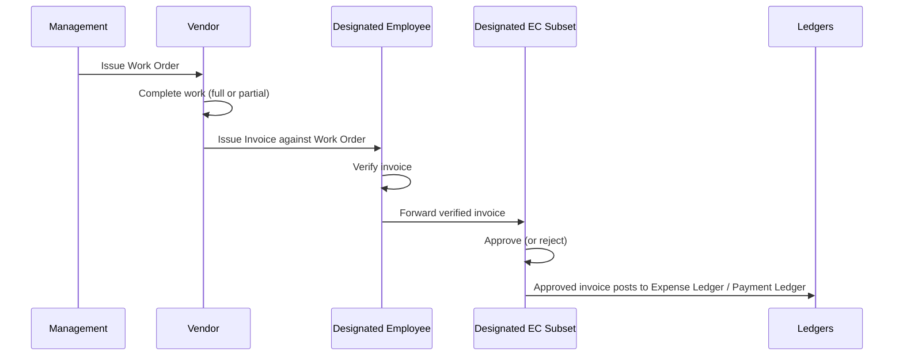

# Flow

# Rules (from the brief)

1. A vendor works only after being issued a **Work Order**.
2. An invoice may cover **full or partial** completion of its work order — multiple invoices per work order must be supported.
3. Every invoice is **verified by a designated employee** before approval.
4. Approval requires a **majority of the designated EC subset** (decided 2026-07-20; see [Governance & Roles](/specifications/governance-and-roles.md)): approvals accumulate per EC member while the invoice is `verified`, and it becomes `approved` once more than half of the designated subset have approved.
5. A **single rejection** by a designated approver is **terminal** (decided 2026-07-20): the invoice goes to `rejected` immediately, discarding any accumulated approvals. The sole recourse is an **EC override** — approvals on the rejected invoice accumulate from **any** EC member, and a majority of the **entire EC** supersedes the rejection and approves it.
6. **Resubmission** (decided 2026-07-20): a finally rejected invoice (no EC override) is never edited or revived. The vendor submits a **fresh invoice** against the same work order — entered by employees like any other — carrying a **link to the rejected predecessor** (`resubmission_of`) for audit continuity. The resubmission goes through the **full workflow again** (verify → approve); rejected invoices do **not** count toward the work order's invoiced total. A rejected invoice can be **either overridden or resubmitted, whichever comes first**: creating a resubmission closes the EC-override window on it, and an overridden (approved) invoice can no longer be referenced as a predecessor — never both, which would double-pay the vendor.
5. The scanned invoice document is stored in bulk storage and linked from the ledger entry (see [Finance & Compliance](/specifications/finance-and-compliance.md)).

# Draft state machine

`WorkOrder`: issued → in_progress → completed | cancelled
`Invoice`: submitted → verified → approved | rejected → paid; rejected → approved (EC override)
(While `verified`, approvals accumulate; `approved` fires at majority of the designated EC subset. One rejection → `rejected`, discarding accumulated approvals. While `rejected`, override approvals accumulate from any EC member; `approved` fires at majority of the entire EC.)

Cumulative invoiced amount per work order should be tracked against the work-order value (over-invoicing should at minimum warn).

# Decisions (2026-07-20)

- **Work-order amendment:** management may amend scope/value/validity **only until the first invoice is submitted**. After that, the options are cancelling the remaining scope or issuing a new work order. No EC action on amendments — the EC gate stays where the money moves, at invoice approval.
- **Payment execution:** recording the vendor payment requires the **finance-recorder capability** (Treasurer by default, delegable to a designated employee); the book (Bank vs Cash) is chosen at recording time, as in the [Admin Panel API](/api/admin/public-api.md).
- **GST input credit:** not tracked in v1. `gst_amount` is captured on invoices for reporting only; an ITC ledger is future scope ([Finance & Compliance](/specifications/finance-and-compliance.md)).
